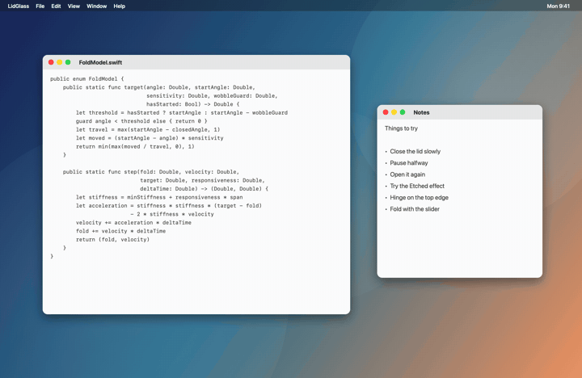

# LidGlass

Inspired by the iPhone Duo animation. As you close a MacBook's lid, your screen turns into
a pane of frosted glass that tips back on the hinge. It follows the lid-angle sensor, so the
glass moves at the speed of your hand, holds when you pause, and retraces when you reopen.

<p align="center">
  
</p>

## Requirements

- macOS 14 or later, Apple silicon or Intel
- A MacBook with the continuous lid-angle sensor. Check with:

  ```sh
  hidutil list --matching '{"PrimaryUsagePage":32,"PrimaryUsage":138}'
  ```

  A `las` device in the output means the sensor is there.
- Xcode command line tools (Swift 6)
- Screen Recording permission for LidGlass. The glass is your own screen, redrawn.

## Build and run

```sh
./create-signing-identity.sh   # once: a local code signing certificate
./build-app.sh                 # builds build/LidGlass.app, at the version in VERSION
open build/LidGlass.app
```

On first launch macOS asks for Screen Recording permission. Allow LidGlass in System
Settings > Privacy & Security > Screen & System Audio Recording, then quit it from the
menu bar icon and open it again. The first launch also takes the current lid angle as the
start angle.

macOS ties the permission to how the app is signed. Signed with the local certificate, the
permission survives rebuilds. Without it, `build-app.sh` signs ad-hoc, which ties the
permission to one exact binary: each rebuild resets the old grant and you allow LidGlass
again. If the menu bar icon shows a warning triangle, the running build does not have
permission.

## Command line

```sh
build/LidGlass.app/Contents/MacOS/LidGlass --angle
    # print the live lid angle, with no permissions needed

build/LidGlass.app/Contents/MacOS/LidGlass --render desktop.png out.png 0.55 etched
    # render the glass over a still image at a given fold (0 to 1) and effect

swift run LidGlassChecks
    # checks for the angle-to-fold math and for release version comparison
```

Set `LIDGLASS_FORCE_FOLD=0.5` when launching the binary to hold the glass at a fixed fold.
Set `LIDGLASS_UPDATE_FEED` to a release feed URL to test updates against something other
than GitHub. The signature check still decides what installs.

## Settings

Open from the menu bar icon.

- **Effect**: Frosted (a smooth blur), Etched (sandblasted grain), Ghost (a see-through
  pane), Smoke (a dark tint), Prism (rainbow edges), Clear (no frost, a glossy highlight).
  Frost reaches full strength about a third of the way closed.
- **Hinge edge**: the glass folds on the bottom edge of the screen, like the lid, or on the
  top edge. Frost grows toward the edge that swings away.
- **Strength**: how strongly the effect shows, from none (just the fold) to full
- **Perspective**, **Edge softness**, **Corner radius**
- **Responsiveness**: how tightly the glass tracks the lid
- **Hinge sensitivity**: fold per degree of lid travel
- **Minimum movement**: degrees the lid has to move before the glass responds. The
  sensor wobbles by about a degree at rest, so keep this at 2 or above.
- **Start angle**: the glass starts folding as the lid closes past this angle. "Use
  current" sets it to where the lid is sitting now. Starting the glass takes the minimum
  movement in degrees past this angle, but once it has started the fold is measured from
  the angle itself, so it stops exactly where it started.
- **Stationary frame rate**: 15 to 120 FPS while the lid is held still mid-fold
- **Idle polling rate**: how often the lid is read while it is still, 5 to 120 times a
  second. Lower rates use less battery but can start the glass later, up to one interval
  after the lid starts moving. Once the lid moves, it is read 120 times a second until
  the glass is flat again.
- Show the lid angle in the menu bar, open at login
- **Hide the system cursor while folded** (on by default): the capture draws the cursor
  into the glass, so the real one would be a second copy. Hiding it from a background app
  takes a private WindowServer setting, looked up at run time. If a future macOS drops it,
  the real cursor simply stays visible.
- **Show on the lock screen** (off by default, with a warning next to it): see
  [Lock Screen](#lock-screen).

The preview shows the material at the slider's fold. "Fold the screen with the slider"
drives the real overlay from the slider instead of the lid. Escape, a click while the
glass is showing, or switching to another window turns it off.

## Updates

With "Update automatically" on (the default), LidGlass checks its GitHub releases a minute
after launch and every six hours. A newer release installs and relaunches LidGlass without
asking, but never while the glass is showing. "Check for Updates…" in the menu bar checks at
any time, whatever the setting, and asks before installing.

An update installs only if its app is signed with the same certificate as the copy already
installed. That is also what keeps Screen Recording permission across the update. A copy
built without the certificate (signed ad-hoc) cannot verify an update, so it never installs
one.

To publish a release, set the new version in `VERSION`, commit, and run:

```sh
./release.sh   # builds, checks the signature, and publishes vVERSION with LidGlass.zip
```

## Lock Screen

Off by default. When it is on, the glass also shows while the screen is locked, folding
over it as the lid closes and lifting away as it opens, the same as the normal effect.

Two things make this different from the rest of the app, and both are why the toggle
carries a warning and defaults to off:

- **It draws above the real lock screen using a private WindowServer call**
  (`SkyLightOperator`), not a documented API. Apple could remove it in any macOS update,
  at which point the toggle simply stops doing anything. It is adapted from
  [Lakr233/SkyLightWindow](https://github.com/Lakr233/SkyLightWindow) (MIT license, its
  notice reproduced in `THIRD-PARTY-NOTICES.md` and in the built app's Resources).
- **It cannot see the real lock screen.** macOS blocks capturing it, the same way it blocks
  capturing your password as you type it, so LidGlass has nothing real to fold. Instead it
  folds a still of your desktop picture, reloaded fresh each time it is about to be
  shown, not only the first time in a lock session, and placed on screen exactly as macOS
  is placing it right now: stretched, filled, fitted, or centered, whichever your Wallpaper
  settings are using, with the same color behind it wherever the picture does not reach.
  Whatever the picture file's own resolution or aspect ratio, what folds is what the screen
  underneath is already showing. The clock, your photo, and the password field are never
  part of what folds.

What keeps it safe to have on: the overlay window never accepts clicks or key presses
(`ignoresMouseEvents`, and it can never become key or main), so the real lock screen and
its password field are always live underneath it, reachable the instant you click or type.
It also never appears on its own: it checks whether the screen is actually locked (an
undocumented key in the session dictionary `CGSessionCopyCurrentDictionary` returns, not a
private call) fresh, every time it would show or stay shown, rather than trusting macOS's
lock notifications, which are not guaranteed delivery. A macOS change that breaks this
check leaves the toggle doing nothing, rather than showing at the wrong time.

Test this yourself before relying on it, as the warning says. A private API that stops
working is a cosmetic failure here, an overlay that failed to hide would not be.

## How it works

- `LidAngleSensor` reads HID feature report 1 from the `las` device. The angle is a
  little-endian 16-bit value in degrees. The sensor also sends the angle unasked, but only
  once a second and it ignores requests to send faster, so it is polled: at the idle rate
  while the lid is still, and 120 times a second from the first movement until the glass
  settles.
- `FoldModel` (in `LidGlassCore`) maps the angle to a fold from 0 to 1. The sensor reports
  whole degrees, so the fold arrives as a staircase. A critically damped spring, stepped on
  every drawn frame rather than on every sensor sample, rides through the steps.
- `ScreenCaptureSource` streams the built-in display with ScreenCaptureKit, excluding
  LidGlass's own windows so the overlay never captures itself. The stream runs only while
  the lid moves or the glass is folded. It drops to the stationary frame rate once the
  lid settles and stops when the glass is flat.
- `GlassRenderer` copies each frame into a mipmapped texture and draws it on a
  click-through window above everything. The vertex shader tips the pane about its bottom
  edge with a perspective divide. The fragment shader gathers a grain-rotated spiral of
  taps from prefiltered mips (frost that scatters rather than smears), heavier toward the
  top, then adds tint, sheen, and a rounded-corner mask.
- Shaders compile at launch from source, because the command line tools do not include
  the offline Metal compiler.
- The app icon is drawn as vectors in `Resources/AppIcon.svg`. `build-app.sh` renders it
  into the bundle's icon whenever the SVG changes.
- `LockScreenController` runs its own copy of the same spring and renderer, rather than
  reusing the main overlay's: while locked, the main overlay's window sits behind the real
  lock screen, and macOS throttles drawing for a window nothing can see. It builds its
  window only while the lock screen setting is on, and only for as long as the screen is
  actually locked, so turning either off leaves nothing running. It never shows the window
  on the strength of a wallpaper reload merely starting: each reload carries a generation
  number, and only a load that both succeeds and is still the newest one requested is
  allowed to apply its picture and reveal the window, so a slow, superseded load can never
  overwrite a faster, newer one, and a failed load leaves the window hidden rather than
  showing whatever picture happened to be cached (failures back off for a couple of seconds
  rather than retrying on every tick). The lid opening back up cancels a reload still in
  flight immediately, going by the raw lid angle rather than waiting for the fold's spring
  to visually catch up, so a load that was only still relevant to the fold that just ended
  can never land and get shown after the fact. The window itself only fades in once the
  fresh frame has actually been presented, and fades out on conceal, rather than snapping
  the previous frame's picture on or off screen. The wallpaper crop matches the desktop's
  own EXIF orientation and the renderer's Display P3 color space, so a sideways photo or a
  saturated one comes out the same as it would on the real desktop.
